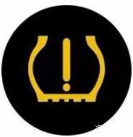

# 组合仪表 - 标志

## 写在前面

依稀记得是2年前，突然收到一条微信，是时常联系的猎头发来的求救信息。她说自己在开车，但是仪表盘上一个灯亮了（见下图），不知道是什么情况，在线等。

作为一个在汽车电子行业的老司机来说（从业百年还差90年），这个图标是再熟悉不过了。它通常表示胎压监测系统（TPMS）相关的问题，比如胎压过低（漏气）等等。

开车的朋友们想必注意到各种各样的符号，特别是走南闯北经验丰富的老司机，以及汽车从业人员，他们对这些符号的用途、表达的意义和点亮时的应对措施非常了解。

然而对于一个新手，小心翼翼的开着车，稳稳的控制着车速，密切注意着周围的情况，突然仪表盘有个灯亮了，这时候再听到滴滴滴的声音，脑子里肯定是一堆问号：怎么突然灯亮了？我该怎么办？是不是应该停下来检查一下？

情急之下，最快速的方法就是问问认识的老司机，或者求助万能的朋友圈了。那么下面就和大家聊聊这些符号，特别是在仪表里面的应用。

>备注：如下文GB4094中的术语，专业的名词是“标志”。但是基于习惯，本文中称之为“符号”。
>>标志 symbol
 用以识别操纵件、指示器及信号装置的图形。

## 常见的符号

在仪表中，“符号”有很多种表现形式，比如说：

* 表牌上印刷的符号
*insert picture here*
* LED透过表牌点亮的报警灯
*insert picture here*
* LCD中显示的报警图标
*insert picture here*
>备注：随着全屏时代的到来，表牌不复存在，LED报警灯终将移到LCD中显示。

下面就列举一些仪表盘上会用到的符号：

| 名称 | 符号 | 颜色 | 备注 |
| ---- | --- | ---- | ---- |
| 远光灯 | ![pic_hb_7000] | 蓝色 | 车辆前照远光灯工作时点亮 |
| 近光灯 | ![pic_lb_7000] | 绿色 | 车辆前照近光灯工作时点亮 |
| 位置灯 | ![pic_pl_7000] | 绿色 | 车辆位置灯工作时点亮   *有时也称之为小灯* |
| 前雾灯 | ![pic_ffl_7000] | 绿色 | 车辆前雾灯工作时点亮 |
| 后雾灯 | ![pic_rfl_7000] | 黄色 | 车辆后雾灯工作时点亮 |
| 转向灯 | ![pic_tl_7000] | 绿色 | 车辆左或右转向灯工作时同步闪烁 |
| 危险警告灯 | ![pic_hw_7000] | 红色 | 车辆仪表台上的危险警告开关按下，左右转向灯会同时闪烁   *应该都见过停在路边的车左右转向灯都在闪烁的情况吧* |
| 发动机预热 | ![pic_dph_7000] | 黄色 | 车辆柴油机发动机预热时点亮   ***存疑，什么情况下点亮*** |
| 缓速器 | ![pic_ret_4094] | 绿色/白色 | 车辆缓速器工作时点亮   ***存疑，什么情况下点亮*** |
| 制动系统故障 | ![pic_bf_4094] | 红色 | 车辆制动系统发生故障是点亮 |
| 燃料量 | ![pic_fuel_4094] | 黄色 | 燃料液位低（通常少于12.5%）或者燃料系统故障时点亮 |
| 蓄电池充电 | ![pic_bcc_7000] | 红色 | 车辆蓄电池充电或者电压异常时点亮 |
| 机油压力 | ![pic_eo_7000] | 红色 | 车辆发动机机油压力低时点亮 |
| 发动机冷却液温度 | ![pic_ect_7000] | 红色 | 车辆发动机冷却液温度高时点亮 |
| 安全带警报 | ![pic_sb_7000] | 红色 | 未寄安全带时点亮   *都听过驾校考试科目三上车没寄安全带开车直接挂科的传说吧* |
| 驾驶室锁止警报 | ![pic_cl_7000] | 红色 | 车辆驾驶室未锁止时点亮 |
| 防抱死系统故障 | ![pic_abs_4094] | 黄色 | 车辆制动防抱死系统故障时点亮   ***存疑，什么情况下点亮*** |
| 驻车制动 | ![pic_pb_4094] | 红色 | 车辆驻车制动（拉手刹）时点亮 |
| 发动机故障 | ![pic_eng_4094] | 黄色 | 车辆发动机故障时点亮 |
| 轮胎故障 | ![pic_tf_7000] | 黄色 | 车辆轮胎胎压高/低，胎温高或者TPMS系统故障时点亮 |

> 表格符号的形状来源于GB 4094-2016

## 标准

上表中提到的符号，国内外标准对于符号的颜色，形状以及如何使用等有详细的定义，国内常用的有GB 4094，国外常用的有ISO 2575和ISO 7000。而且这些标准经常会更新，一般我们使用最新的即可。

另外，有一点需要特别注意，某些符号的形状在不同的标准中不太一样，如下表：

| 标志 | GB 4094 | ISO 2575 | ISO 7000 | 备注 |
| ---- | ------ | -------- | -------- | ----- |
| 发动机故障 | ![pic_eng_4094] | ![pic_eng_2575] | ![pic_eng_7000] | 右边尾部线条的区别 |
| 制动系统故障 | ![pic_bf_4094] | ![pic_bf_2575] | ![pic_bf_7000] | 圆弧内外圈和感叹号的区别 |
| 自动大灯 | ![pic_ah_4094] | ![pic_ah_2575] | 无 | 字母‘A’的字体和粗细的区别 |

## 参考文献
1. GB 4094-2016 汽车操纵件、指示器及信号装置的标志  
2. ISO 2575-2010 Road vehicles — Symbols for controls, indicators and tell-tales  
3. ISO 7000-2004 Graphical symbols for use on equipment — Index and synopsis

[pic_ah_4094]: ./attachments/GB4094_图3.A.png "Automatic Headlamp"
[pic_ret_4094]: ./attachments/GB4094_图19.png "Retarder"
[pic_bf_4094]: ./attachments/GB4094_图20.png "Brake Failure"
[pic_fuel_4094]: ./attachments/GB4094_图21.png "Fuel"
[pic_abs_4094]: ./attachments/GB4094_图37.png "Anti-lock Brake System"
[pic_pb_4094]: ./attachments/GB4094_图38.png "Parking Brake"
[pic_eng_4094]: ./attachments/GB4094_图43.png "Engine"

[pic_ah_2575]: ./attachments/ISO2575_A.36.png "Automatic Headlamp"
[pic_bf_2575]: ./attachments/ISO2575_B.01.png "Brake Failure"
[pic_eng_2575]: ./attachments/ISO2575_F.01.png "Engine"

[pic_hb_7000]: ./attachments/ISO7000_0082_Highbeam.png "High Beam"
[pic_lb_7000]: ./attachments/ISO7000_0083_Lowbeam.png "Low Beam"
[pic_tl_7000]: ./attachments/ISO7000_0084_Turnsignals.png "Turning Lights"
[pic_hw_7000]: ./attachments/ISO7000_0085_Hazardwarning.png "Hazard Warning"
[pic_bf_7000]: ./attachments/ISO7000_0239_Brakefailure.png "Brake Failure"

[pic_ect_7000]: ./attachments/ISO7000_0246_Enginecoolanttemperature.png "Engine Coolant Temperature"
[pic_bcc_7000]: ./attachments/ISO7000_0247_Batterychargingcondition.png "Battery Charging Condition"
[pic_eo_7000]: ./attachments/ISO7000_0248_Engineoil.png "Engine Oil"
[pic_sb_7000]: ./attachments/ISO7000_0249_Seatbelt.png "Seatbelt"
[pic_pl_7000]: ./attachments/ISO7000_0456_Positionlights.png "Position Lights"
[pic_dph_7000]: ./attachments/ISO7000_0457_Dieselpreheat.png "Diesel Preheat"
[pic_ffl_7000]: ./attachments/ISO7000_0633_Frontfoglight.png "Front Fog Light"
[pic_rfl_7000]: ./attachments/ISO7000_0634_Rearfoglight.png "Rear Fog Light"
[pic_eng_7000]: ./attachments/ISO7000_0640_Engine.png "Engine"
[pic_tf_7000]: ./attachments/ISO7000_1434B_Tyrefailure.png "Tyre Failure"
[pic_cl_7000]: ./attachments/ISO7000_1560_Cablock.png "Cab Lock"
[pic_acc_7000]: ./attachments/ISO7000_2580_Adaptivecruisecontrol.png "Adaptive Cruise Control"
