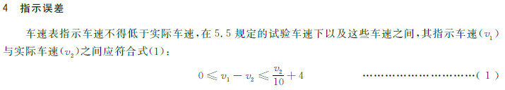
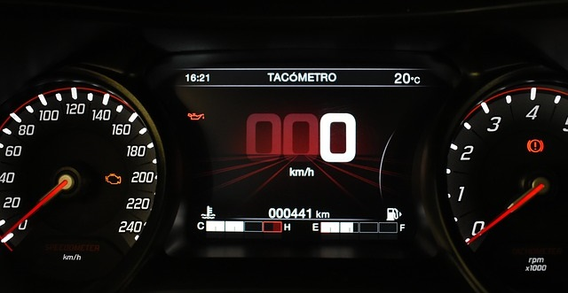
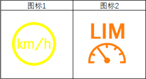
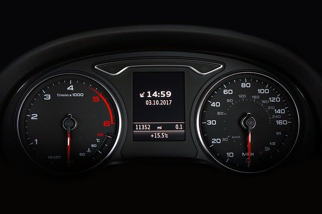

# 组合仪表 - 车速表（Speedometer）的应用

## 写在前面

有一天下班回家后，正在带孩子玩，这时候老婆开门回家了，宝宝看到妈妈很高兴。老婆走过来抱起宝宝，然后扭过头严肃的对我说：

*老婆大大：今天开车回来的时候，在一个红绿灯路口好像超速了。  
小的我：红绿灯路口不减速啊，你开多少？  
老婆大大：那个路口限速60，过红绿灯的时候虽然踩了刹车，可是来不及了，速度应该61左右。  
小的我：哦，61啊，没事，还没超速！  
老婆好奇的看着我，还以为我开玩笑呢。*

那就来和大家说说说汽车上显示车速的这个车速表，为啥显示61了，还不算超速呢？

## 都是标准惹的祸

我们从车速表上看到的速度，其实是仪表想让驾驶员看到的“假”速度（GB 15082中称为**指示车速**），它不是车辆当前的“真”速度（GB 15082中称为**实际车速**）。根据GB 15082中的定义，指示车速要比实际车速大，它们之间的差值需要在其规定的误差范围内（参考下图标准原文截屏）。

根据这个公式，我们一起来温习一下小学数学：已知实际车速 V2 = 60，求指示车速 V1 的范围。

答：指示车速 V1 的范围为：**60 ≤ V1 ≤ 70**。

然而，主机厂（OEM）在符合GB 15082试验规范的条件下，他们的企业标准对指示车速的误差范围会有更加详细的定义。针对同一个速度，不同的主机厂定义会有稍微的差别，例如：

* OEM A：当实际车速 V2 = 56.5 km/h时，指示车速 V1 的误差范围为：58.5 ~ 61.5 km/h。（此处以实际车速为基准）
* OEM B：当指示车速 V1 = 60 km/h时，实际车速 V2 的校验范围为：55 ~ 60 km/h。（此处以指示车速为基准）

通常在设计的时候，供应商（Tire 1）会将实际速度放大显示，当然控制在主机厂提供的误差范围内。因此车速表指示 61 km/h 时，车的实际速度基本上不到 60 km/h。

## 车速显示方式

传统的汽车仪表，是一个个独立的模拟表头，用于显示必要的信息（例如车速，转速，水温等等）。之后发展成组合仪表，把所有的表头集成到一起。随着科技的发展，LCD开始应用于仪表，丰富了仪表显示的车辆信息。

起初段码屏、点阵屏以及单色TFT屏，可以设计数字方式显示车速。现如今，仪表中的采用彩色TFT，屏幕尺寸越来越大，色彩也越来越丰富，在LCD上显示设计的模拟表头也很有科技感。

* 指针表：参考下图中左边的指针  
  模拟表头，通过控制指针偏转的角度，来达到显示车速的目的。设计上应该保证指针平滑的运动，不能出现抖动或大幅跳动的情况。
  * 机械机构的模拟表头，由步进电机驱动指针，指向表牌上印刷的数字。
  * LCD中的模拟表头，由软件逻辑控制屏幕上的指针转动，指向圆弧边的数字。
* 数字显示：参考下图中间LCD上显示的数字（000 km/h）  
  数字相对于模拟表头来说，看起来更加方便。但是设计上应该考虑数值变化时的连贯性。
  
>题外话：我自己平时开车时，喜欢看LCD中显示的数字，对我来说，这样更直观。

## 珍爱生命，控制车速

市场上部分车辆有超速报警功能，通常报警的阈值可以通过人机交互界面（HMI）自行设置，当车速超过设定的阈值，对应的报警符号会点亮，并且伴随声音报警，用于提醒司机及时减速。

由于车辆的速度是一个动态变化的值（巡航模式除外），踩油门车速加快，松开油门车速慢慢降低。因此在设计的时候需要考虑设置一个合适的范围，用来避免车速在一个值左右变化，导致时而报警时而不报警。

由于标准中没有专门的超速报警指示符号，因此不同的车报警符号不太一样，下面列举2个比较常见的:

## 车速从哪里来

车身上仪表接收车速信号一般有2种方式：
* 频率信号：来自于车速传感器，计算公式为 F = V * PPK / 3600，其中
  * F：输入给仪表的频率值，单位Hz
  * V：实际车速，单位 km/h
  * PPK：每公里脉冲数（**P**ulse **P**er **K**ilometer）
  * 针对这种传感器，需要主机厂提供相关等效电路，用于仪表端采集电路的设计，避免电路不适配导致频率采集出现问题。
* CAN信号：车身上其他控制器直接采集车速传感器的频率信号，经过计算后，通过CAN信号发给仪表。
  * 对于商用车，一般都遵循标准 SAE J1939，报文为TCO1（PGN：65132, SPN 1624）。
  * 对于乘用车，每个主机厂都有自己特殊的定义，请参考他们提供的CAN DBC文件。

## 公里英里傻傻分不清

前文的阐述中默认采用的是公制单位，但是如果车辆需要出口到使用英制单位的国家或地区时，则需要考虑单位换算。

最具代表性的是有些美式汽车，他们车速表的设计，会同时出现英制（mph）和公制（km/h）。当在美国境内正常驾驶时使用英制单位，如果跨境开往墨西哥或者加拿大，则采用公制单位。参考下图的设计：

>PS: 1 英里（mile） = 1.609344 公里（km）。
 美式英制单位，与传统的英制单位有所区别。

## 写在后面

>本文中如有错误，会在[GitHub][]中及时更正，当然非常欢迎大家反馈意见。

更多文章请关注微信公众号：

## 参考文献
1. GB 15082-2008 汽车用车速表
2. J1939DA 2017
3. [pixabay](https://pixabay.com/)

[GitHub]:https://github.com/JacobLeung0313/Automotive-Electronics/blob/master/Instrument-Cluster/Speedometer.md