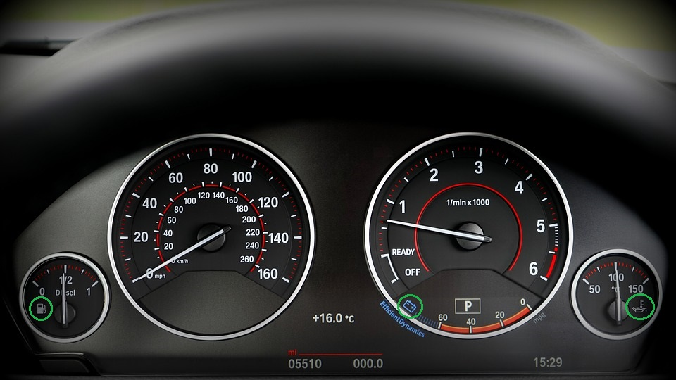
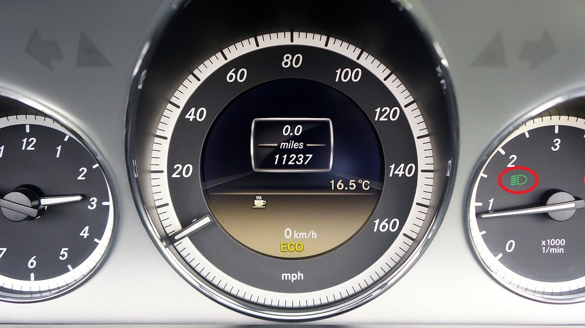
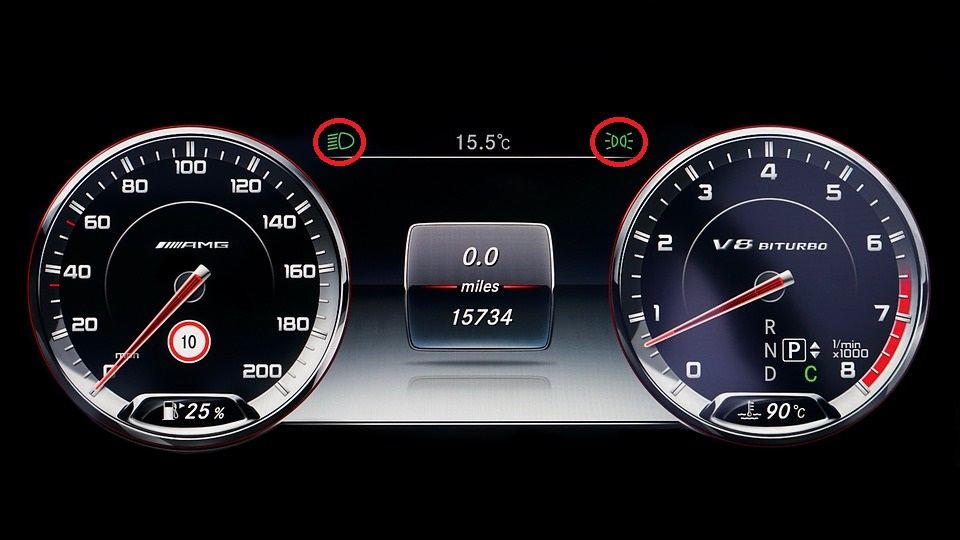

# 组合仪表 - 标志（Symbols）的应用

## 写在前面

依稀记得是2年前，突然收到一条微信，是时常联系的猎头发来的求救信息。她说自己在开车，但是仪表盘上一个灯亮了（见下图），不知道是什么情况，在线等。  

作为一个在汽车电子行业的老司机来说（从业百年还差90年），这个图标是再熟悉不过了。它通常表示轮胎相关的问题，比如胎压过低（漏气）等等。

开车的朋友们想必注意到各种各样的符号，特别是走南闯北经验丰富的老司机，以及汽车从业人员，他们对这些符号的用途、表达的意义和点亮时的应对措施非常了解。

然而对于一个新手，小心翼翼的开着车，稳稳的控制着车速，密切注意着周围的情况，突然仪表盘有个灯亮了，这时候再听到滴滴滴的声音，脑子里肯定是一堆问号：怎么突然灯亮了？我该怎么办？是不是应该停下来检查一下？

情急之下，最快速的方法就是问问认识的老司机，或者求助万能的朋友圈了。那么下面就和大家聊聊这些符号，特别是在仪表里面的应用。

>PS: 标准中术语是“标志”。但是基于习惯，本文中称之为“符号”。  
***标志 symbol***  
*用以识别操纵件、指示器及信号装置的图形。*

## 符号的表现形式

在仪表中，“符号”有很多种表现形式，比如说：

* 表牌上印刷的符号
  *参考下图中绿色圆圈中的3个符号*  
  
 
* LED透过表牌点亮的报警灯
  *参考下图中红色圆圈中的符号*  
  

* LCD中显示的报警符号
  *参考下图中红色圆圈中的2个符号*  
  

>PS:  
随着全屏时代的到来，表牌不复存在，LED报警灯终将移到LCD中显示。  
上面3张图片由MikesPhotos在Pixabay上发布​。

其中表牌上印刷的符号用于表明其指示的是什么信息，没有逻辑功能，所以下文仅侧重于描述LED点亮和LCD中显示的符号的用途。

## 常见的符号

下表就列举一些仪表盘上常用的符号：

| 名称 | 符号 | 颜色 | 显示效果 | 工作条件 |
| ---- | --- | ---- | ---- | ---- |
| 远光灯 | ![][pic_hb_7000] | 蓝色 | ![][pic_hb_7000b] | 车辆前照远光灯工作时点亮 |
| 近光灯 | ![][pic_lb_7000] | 绿色 | ![][pic_lb_7000g] | 车辆前照近光灯工作时点亮 |
| 位置灯 | ![][pic_pl_7000] | 绿色 | ![][pic_pl_7000g] | 车辆位置灯工作时点亮   *有时也称之为小灯* |
| 前雾灯 | ![][pic_ffl_7000] | 绿色 | ![][pic_ffl_7000g] | 车辆前雾灯工作时点亮 |
| 后雾灯 | ![][pic_rfl_7000] | 黄色 | ![][pic_rfl_7000y] | 车辆后雾灯工作时点亮 |
| 转向灯 | ![][pic_tl_7000] | 绿色 | ![][pic_tl_7000g] | 车辆左或右转向灯工作时同步闪烁  *左转向时左边灯闪烁，右转向时右边灯闪烁，左右同时闪烁参考“危险警告灯“* |
| 危险警告灯 | ![][pic_hw_7000] | 红色 | ![][pic_hw_7000r] | 车辆仪表台上的危险警告开关按下，左右转向灯会同时闪烁  *应该都见过停在路边的车左右转向灯都在闪烁的情况吧* |
| 发动机预热 | ![][pic_dph_7000] | 黄色 | ![][pic_dph_7000a] | 车辆柴油机发动机预热时点亮 |
| 缓速器 | ![][pic_ret_4094] | 绿色/白色 | ![][pic_ret_4094g] | 车辆缓速器工作时点亮 |
| 制动系统故障 | ![][pic_bf_4094] | 红色 | ![][pic_bf_4094r] | 车辆制动系统发生故障时点亮 |
| 燃料量 | ![][pic_fuel_4094] | 黄色 | ![][pic_fuel_4094a] | 燃料液位低（通常少于12.5%）或者燃料系统故障时点亮 |
| 蓄电池充电 | ![][pic_bcc_7000] | 红色 | ![][pic_bcc_7000r] | 车辆蓄电池充电或者电压异常时点亮 |
| 机油压力 | ![][pic_eo_7000] | 红色 | ![][pic_eo_7000r] | 车辆发动机机油压力低时点亮 |
| 发动机冷却液温度 | ![][pic_ect_7000] | 红色 | ![][pic_ect_7000r] | 车辆发动机冷却液温度高时点亮 |
| 安全带警报 | ![][pic_sb_7000] | 红色 | ![][pic_sb_7000r] | 未寄安全带时点亮  *都听过驾校考试科目三上车没寄安全带开车直接挂科的传说吧* |
| 驾驶室锁止警报 | ![][pic_cl_7000] | 红色 | ![][pic_cl_7000r] | 车辆驾驶室未锁止时点亮 |
| 防抱死系统故障 | ![][pic_abs_4094] | 黄色 | ![][pic_abs_4094a] | 车辆制动防抱死系统故障时点亮 |
| 驻车制动 | ![][pic_pb_4094] | 红色 | ![][pic_pb_4094r] | 车辆驻车制动（拉手刹）时点亮 |
| 发动机故障 | ![][pic_eng_4094] | 黄色 | ![][pic_eng_4094a] | 车辆发动机故障时点亮 |
| 轮胎故障 | ![][pic_tf_7000] | 黄色 | ![][pic_tf_7000a] | 车辆轮胎胎压高/低，胎温高或者TPMS系统故障时点亮 |

>PS：  
>表格符号的形状参考GB 4094-2016。  
>表格中“工作条件”部分对于符号点亮的功能逻辑描述比较简单，在后续的文章中会针对一些比较重要的符号详细介绍。  
>细心的朋友可以看出来显示效果中的某些符号和左边的不完全一样，这是因为标准并不是严格规定所有线条必须一模一样，可以根据实际情况修改。  

## 执行标准

上表中提到的符号，国内外标准对于符号的颜色，形状以及如何使用等有详细的定义，国内有GB 4094，国外有ISO 2575和ISO 7000。而且这些标准经常会更新，所以设计的时候应该注意引用的是哪个版本。

另外，有一点需要特别注意，某些符号的形状在不同的标准中不太一样，下面列举3个作为参考：

| 标志 | GB 4094 | ISO 2575 | ISO 7000 | 备注 |
| ---- | ------ | -------- | -------- | ----- |
| 发动机故障 | ![][pic_eng_4094] | ![][pic_eng_2575] | ![][pic_eng_7000] | 右边尾部线条弧度的区别 |
| 制动系统故障 | ![][pic_bf_4094] | ![][pic_bf_2575] | ![][pic_bf_7000] | 圆弧内外圈粗细，和感叹号的区别 |
| 自动大灯 | ![][pic_ah_4094] | ![][pic_ah_2575] | 无 | ‘A’的字体和粗细的区别 |

## 写在后面

本文同步发布于微信公众号：**思齐奶爸**，阅读文章请回复关键字：**标志**。  

由于此公众号没有评论功能，因此想对此文章发表评论，请移步Github、简书和知乎。
* Github：[JacobLeung0313][]，Repositories：Automotive-Electronics。
* 简书：[JacobLeung][]，专题：汽车之组合仪表。
* 知乎：[不是小强][]，专栏：汽车ECU应用。

>本文中如有错误，会在Github、简书和知乎中及时更正，当然非常欢迎大家反馈意见。

## 参考文献

1. GB 4094-2016 汽车操纵件、指示器及信号装置的标志  
2. ISO 2575-2010 Road vehicles — Symbols for controls, indicators and tell-tales  
3. ISO 7000-2004 Graphical symbols for use on equipment — Index and synopsis 
    [See more symbols on the webpage](https://www.iso.org/obp/ui/#iso:pub:PUB400001:en)
4. [pixabay](https://pixabay.com/)

[JacobLeung0313]:https://github.com/JacobLeung0313/Automotive-Electronics/blob/master/Instrument-Cluster/Symbols.md

[JacobLeung]:https://www.jianshu.com/p/ce19a84b7bf2

[不是小强]:https://zhuanlan.zhihu.com/p/98042975
 
[pic_ah_4094]: ./attachments/GB4094_图3.A.png "Automatic Headlamp"
[pic_ret_4094]: ./attachments/GB4094_图19.png "Retarder"
[pic_ret_4094g]: ./attachments/GB4094_图19_g.png "Retarder"
[pic_bf_4094]: ./attachments/GB4094_图20.png "Brake Failure"
[pic_bf_4094r]: ./attachments/GB4094_图20_r.png "Brake Failure"
[pic_fuel_4094]: ./attachments/GB4094_图21.png "Fuel"
[pic_fuel_4094a]: ./attachments/GB4094_图21_a.png "Fuel"
[pic_abs_4094]: ./attachments/GB4094_图37.png "Anti-lock Brake System"
[pic_abs_4094a]: ./attachments/GB4094_图37_a.png "Anti-lock Brake System"
[pic_pb_4094]: ./attachments/GB4094_图38.png "Parking Brake"
[pic_pb_4094r]: ./attachments/GB4094_图38_r.png "Parking Brake"
[pic_eng_4094]: ./attachments/GB4094_图43.png "Engine"
[pic_eng_4094a]: ./attachments/GB4094_图43_a.png "Engine"

[pic_ah_2575]: ./attachments/ISO2575_A.36.png "Automatic Headlamp"
[pic_bf_2575]: ./attachments/ISO2575_B.01.png "Brake Failure"
[pic_eng_2575]: ./attachments/ISO2575_F.01.png "Engine"

[pic_hb_7000]: ./attachments/ISO7000_0082_Highbeam.png "High Beam"
[pic_hb_7000b]: ./attachments/ISO7000_0082_Highbeam_b.png "High Beam"
[pic_lb_7000]: ./attachments/ISO7000_0083_Lowbeam.png "Low Beam"
[pic_lb_7000g]: ./attachments/ISO7000_0083_Lowbeam_g.png "Low Beam"
[pic_tl_7000]: ./attachments/ISO7000_0084_Turnsignals.png "Turning Lights"
[pic_tl_7000g]: ./attachments/ISO7000_0084_Turnsignals_g.png "Turning Lights"
[pic_hw_7000]: ./attachments/ISO7000_0085_Hazardwarning.png "Hazard Warning"
[pic_hw_7000r]: ./attachments/ISO7000_0085_Hazardwarning_r.png "Hazard Warning"
[pic_bf_7000]: ./attachments/ISO7000_0239_Brakefailure.png "Brake Failure"
[pic_ect_7000]: ./attachments/ISO7000_0246_Enginecoolanttemperature.png "Engine Coolant Temperature"
[pic_ect_7000r]: ./attachments/ISO7000_0246_Enginecoolanttemperature_r.png "Engine Coolant Temperature"
[pic_bcc_7000]: ./attachments/ISO7000_0247_Batterychargingcondition.png "Battery Charging Condition"
[pic_bcc_7000r]: ./attachments/ISO7000_0247_Batterychargingcondition_r.png "Battery Charging Condition"
[pic_eo_7000]: ./attachments/ISO7000_0248_Engineoil.png "Engine Oil"
[pic_eo_7000r]: ./attachments/ISO7000_0248_Engineoil_r.png "Engine Oil"
[pic_sb_7000]: ./attachments/ISO7000_0249_Seatbelt.png "Seatbelt"
[pic_sb_7000r]: ./attachments/ISO7000_0249_Seatbelt_r.png "Seatbelt"
[pic_pl_7000]: ./attachments/ISO7000_0456_Positionlights.png "Position Lights"
[pic_pl_7000g]: ./attachments/ISO7000_0456_Positionlights_g.png "Position Lights"
[pic_dph_7000]: ./attachments/ISO7000_0457_Dieselpreheat.png "Diesel Preheat"
[pic_dph_7000a]: ./attachments/ISO7000_0457_Dieselpreheat_a.png "Diesel Preheat"
[pic_ffl_7000]: ./attachments/ISO7000_0633_Frontfoglight.png "Front Fog Light"
[pic_ffl_7000g]: ./attachments/ISO7000_0633_Frontfoglight_g.png "Front Fog Light"
[pic_rfl_7000]: ./attachments/ISO7000_0634_Rearfoglight.png "Rear Fog Light"
[pic_rfl_7000y]: ./attachments/ISO7000_0634_Rearfoglight_y.png "Rear Fog Light"
[pic_eng_7000]: ./attachments/ISO7000_0640_Engine.png "Engine"
[pic_tf_7000]: ./attachments/ISO7000_1434B_Tyrefailure.png "Tyre Failure"
[pic_tf_7000a]: ./attachments/ISO7000_1434B_Tyrefailure_a.png "Tyre Failure"
[pic_cl_7000]: ./attachments/ISO7000_1560_Cablock.png "Cab Lock"
[pic_cl_7000r]: ./attachments/ISO7000_1560_Cablock_r.png "Cab Lock"