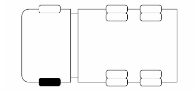
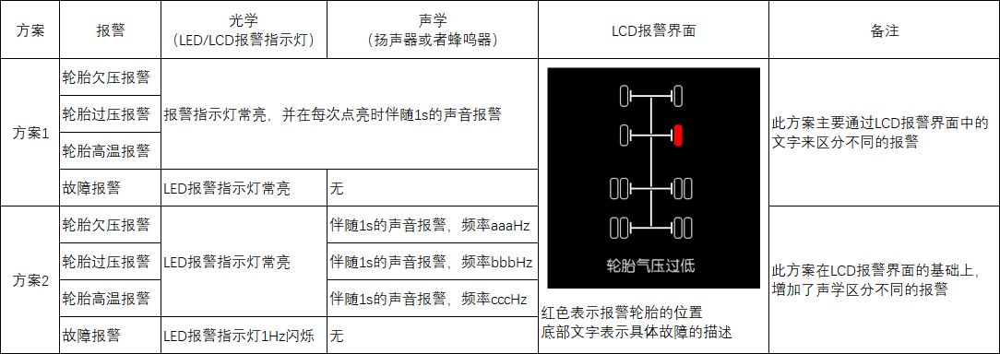
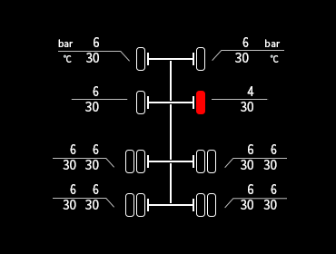

# 组合仪表 - 轮胎气压监测系统（TPMS）的应用

## 前言

想必商用车圈里的朋友知道今年年中（2019-07-01）实施了一个法规：T/T 1178.2-2019。并且规定了在2020年5月1日起对新生产车型实施，其中有一条对胎压监测系统有要求。

>标准原文摘录如下：  
>6.5 最高车速大于或等于 90 km/h 的牵引车辆，使用单胎的车轮应安装轮胎气压监测系统（TPMS）或具有轮胎气压监测功能的装置。TPMS或具有轮胎气压监测功能装置的性能应符合附录B的规定，其电磁兼容性应符合 GB/T 18655 中第3级及 GB/T 17619 的规定。

因此，最近几个月以来，我们陆续收到各大主机厂关于实施TPMS的工程更改，所以今天就想和大家分享一下TPMS在仪表中的实现方案。

## 解读标准（无规矩不成方圆）

根据标准的要求，车辆应该具备以下报警功能：

* 轮胎**欠压**报警：≤75%的轮胎推荐压力Prec
* 轮胎**过压**报警：≥130%的轮胎推荐压力Prec
* 轮胎**高温**报警：≥90℃
* **故障**报警：比如系统故障，通讯丢失等等

当有报警触发时，应该通过**信号装置**向驾驶员发出光学报警信号，并且需要指示出轮胎的具体位置（系统故障除外）。也可以附加文字说明，或者以声学等方式来辅助报警。

>**故障**报警与轮胎位置无关。

当轮胎欠压、轮胎过压、轮胎高温和系统故障共用一个信号装置，则它们报警的表示方法应有明显的区分。

当报警触发后，对于点亮**信号装置**有的时效性定义如下：
* 轮胎**欠压**报警：10s内
* 轮胎**过压**报警：10s内
* 轮胎**高温**报警：3分钟内
* **故障**报警：10分钟内

>个人认为这里的时间定义不算太严格。

## 信号装置

标准中对于**信号装置**有详细的要求，那么在仪表中可以通过如下方式实现：  

* 光学：报警指示灯可以通过LED或者LCD显示。  
  颜色为黄色，符号GB 4094中有定义（如下图）。  
  
* LCD界面：接近真实车辆外形的示意图（轮胎位置），并且能显示轮胎气压值和轮胎温度值。    
  
* 声学：可以通过蜂鸣器或者扬声器。

## 自检

自检的作用是检查设备是否可以正常运行，实现的过程中，自检逻辑需要考虑一下几点：
* 报警指示灯的自检方式和时间？  
  TPMS相关的报警指示灯，通常是仪表控制自检，但是也有一些排放相关的灯是跟随其系统发过来的信号自检（例如OBD MIL灯）。  
  标准中定义自检的时间不能超过10s，但是一般仪表自检时间为3s左右。
* 报警指示灯是通过LED还是LCD实现的？  
  如果是通过LED实现的，那么直接在自检期间点亮即可。  
  如果是通过LCD实现的，那么自检时LCD显示的内容需要得到主机厂的确认。因为一般LCD自检时显示的内容，要么显示Logo，要么是开机动画。
* 自检过程是否可以被中断？
  例如自检过程中，司机挂挡开车，那么是否持续自检，还是结束自检显示行车界面？  
  通常车辆移动后，行车页面中显示的信息对司机来说更加重要。

## 报警实现方式

如前文所述，共用一个信号装置时，报警的方式应有明显的区分。那么，具体可以设计哪些报警方式呢？

* 光学：LED或LCD中点亮的报警符号
  * 一直常亮
  * 闪烁显示，比如1Hz（500ms点亮，500ms熄灭）
* 声学：扬声器或者蜂鸣器
  * 一直鸣叫
  * 间歇鸣叫，比如2Hz（500ms鸣叫，500ms停止）
  * 声音的频率，比如1000Hz，500Hz（频率越高，声音越尖）
* LCD报警界面：轮胎位置，附加文字说明

所以，为了区分报警方式，可以使用上面的方式进行排列组合，例如：  

## 胎温胎压显示

除了报警的页面，LCD中还需要设计一个菜单页面用于显示所有轮胎的气压值，和温度值。参考下图中的示意图：  

>针对有故障的轮胎，可以显示为红色，并且闪烁引起司机的注意  
>通常轮胎的位置，胎压值和胎温值是通过同一条报文发出来的，TPMS系统一帧帧循环发送每个轮胎的信息。

## 写在后面

本文同步发布于微信公众号：**思齐奶爸**，阅读文章请回复关键字：**TPMS**。  

由于此公众号没有评论功能，因此想对此文章发表评论，请移步Github、简书和知乎。
* Github：[JacobLeung0313][]，Repositories：Automotive-Electronics。
* 简书：[JacobLeung][]，专题：汽车之组合仪表。
* 知乎：[不是小强][]，专栏：汽车ECU应用。

>本文中如有错误，会在Github、简书和知乎中及时更正，当然非常欢迎大家反馈意见。

## 参考文献

1. GB 4094-2016 汽车操纵件、指示器及信号装置的标志 
2. JT/T 1178.2-2019 营运货车安全技术条件  第2部分：牵引车辆与挂车

[JacobLeung0313]:https://github.com/JacobLeung0313/Automotive-Electronics/blob/master/Instrument-Cluster/TPMS.md

[JacobLeung]:https://www.jianshu.com/p/a7377ad756c1

[不是小强]:https://zhuanlan.zhihu.com/p/99161275